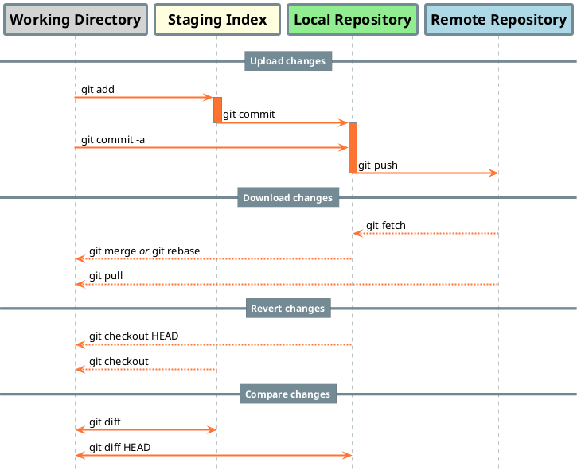

> These are my personal notes written during *{{ page.course_name }}* by [{{ page.course_author_name }}]({{ page.course_author_github }}){:target="_blank"}.


## History of Git

> Git is an open source software for distributed version control.

> It was created in 2005 by Linus Torvalds (creator of Linux) as a replacement for BitKeeper to manage Linux kernel source code.

> Git is usually used for coordinating work among programmers collaboratively developing source code during software development. Its goals include speed, data integrity, and support for distributed, non-linear workflows (thousands of parallel branches running on different systems).

> [GitHub](https://github.com/){:target="_blank"}, [GitLab](https://gitlab.com/){:target="_blank"} and [Bitbucket](https://bitbucket.org){:target="_blank"} are a cloud based hosting services based on [Git software](https://git-scm.com){:target="_blank"}.


## Git installation (Windows)

- Download latest version of **Git Bash** from official Git sites: [https://git-scm.com](https://git-scm.com){:target="_blank"}
- Follow the steps and install the package
- This is how I personally proceed the installation procedure:
	- TrueType: yes
	- Default editor: Notepad++ (up to user preference)
	- PATH environment: Git from command line and from 3rd-party software
	- Install MSYS2 (ridk install): yes
	- Use OpenSSL library: yes
	- Windows-style: no
    - Unix-style line ending: yes
	- MinTTY terminal (Linux style terminal): yes


## Git configuration

### 3 levels of Git configuration:

- **System level configuration**  
	- Config storage: `Program Files\Git\etc\gitconfig*`  
	- See actual settings: `git config --system --list`  
	- Change settings: `git config --system <options>`
- **User level configuration**
	- Config storage: `*$HOME\.gitconfig*`  
	- See actual settings: `git config --global --list`  
	- Change settings: `git config --global <options>`
- **Project level configuration**
	- Config storage: `project_folder\.git\config`  
	- See actual settings: `git config --local --list`  
	- Change settings: `git config --local <options>`


### Essential configuration of Git:

To make Git work properly, it is necessary to set **Username** and **Email** in user level configuration:

- Open Git Bash
- Set your **Username** with command:  
	`git config --global user.name "Your Name"`
- Set your **Email** with command:  
	`git config --global user.email "you@example.com"`

### Optional configuration of Git:

- You can set your default text editor by command:  
	- **Vim**: `git config --global core.editor "vim"`
	- **Notepad**: `git config core.editor notepad`
	- **Notepad++**: `git config --global core.editor "'C:/Program Files/Notepad++/notepad++.exe' -multiInst -notabbar -nosession -noPlugin"`
	- **Visual Studio Code**: `git config --global core.editor "code --wait"`
	- **Atom**: `git config --global core.editor "atom --wait"`
	- **Sublime Text**: `git config --global core.editor "'C:/Program Files (x86)/sublime text 3/subl.exe' -w"`
	- [Other text editors](https://git-scm.com/book/en/v2/Appendix-C%3A-Git-Commands-Setup-and-Config){:target="_blank"}
- You can **allow colors** in Git with command:  
	`git config --global color.ui true`

### Optional configuration of Bash

Bellow you can see my personal Bash settings.

- Open Git Bash and open ".bashrc" config by command:
	```bash
	notepad.exe ~/.bashrc
	```
- You can paste your setting in ".bashrc", e.g. something like this:
	```bash
	# Use Notepad++ instead of classic Notepad
	alias notepad="/c/Program\ Files/Notepad++/notepad++.exe"
	
	# Enable color support for ls, dir, grep...
	alias ls='ls --color=auto'
	alias dir='dir --color=auto'
	alias vdir='vdir --color=auto'
	alias grep='grep --color=auto'
	alias fgrep='fgrep --color=auto'
	alias egrep='egrep --color=auto'
	
	# Allowing colors in shell
	case "$TERM" in
	    xterm-color) color_prompt=yes;;
	esac

	# Ask before copy, move, remove
	alias cp="cp -i"
	alias mv="mv -i"
	alias rm="rm -i"
	
	# Prevents accidentally clobbering files.
	alias mkdir='mkdir -p'

	# Shell history: remember last 1000 commands
	export HISTSIZE=1000

	# Shell history: ignore duplicates and commands starting with space
	export HISTCONTROL=$HISTCONTROL:ignoreboth

	# Shell history: make Bash append to history rather than overwrite it:
	shopt -s histappend

	# Shell history: after each command, append to the history file and reread it
	PROMPT_COMMAND="${PROMPT_COMMAND:+$PROMPT_COMMAND$'\n'}history -a; history -c; history -r"
	```


## Getting started

### Initialize a local repository:

> To get started, create a new project and start to track changes in a project folder

- Create project folder with command:  
	`mkdir First_Project`
- Go to project folder with command:  
	`cd First_Project`
- Initialize a repository inside project folder with command:  
	`git init`  
	
> "git init" creates a ".git" folder inside project directory where all changes are recorded


### Commit the change

> When you finish your changes in your project folder and you are ready to record new version, commit the changes in local repository

- First, make your changes in the project folder. You can use your favourite text editor.
- Add all changes in project folder to the [staging index](#h-the-3-trees) with command:  
	`git add .`  
	or  
	`git add --all`
- Commit the changes to repository with command:  
	`git commit -m "Initial commit"`

	The message parameter "-m" is the way to describe the change. It should be a short single-line summary with less than 50 characters


### View the commit log

Show all commits done inside the project:  
`git log`

Show last 5 commits done inside the project:  
`git log -n 5`

Show all commits done from 1.1.2021:  
`git log --since=2021-01-01`

Show all commits done until 1.1.2021:  
`git log --until=2021-01-01`

Show all commits from David (don't need to write full name):  
`git log --author="David"`

Show all commits containing "Init" (works with Regex):  
`git log --grep="Init"`


## Git concepts and architecture

### The 3-trees

Git uses a 3-trees architecture:

1. **Working directory** - contains changes that may not be tracked by Git yet
2. **Staging index** - contains changes that we are about to commit into repository 
3. **Repository** - committed files which are tracked by Git


	```plantuml!
	@startuml
	'!theme materia-outline
	skinparam activity {
		FontSize				12
		FontStyle				Bold
		FontColor				white
		ArrowColor				#506169
		ArrowThickness			2
		BorderThickness			2
		DiamondFontColor		black
		BackgroundColor			#748b95
		DiamondBackgroundColor	#ffb998
		BorderColor				#506169
		DiamondBorderColor		#ff7332	
	}
	skinparam {
		Padding					2
		Ranksep					30
		'Linetype				ortho
		'Monochrome				true
	}
	:Working directory;
	-> git add;
	:    Staging index    ;
	-> git commit;
	:      Repository      ;
	```


### Hash values

- Git uses SHA-1 hash algorithm to keep data integrity (40-character hexadecimal string - contains 0-9 and a-f)
- Git generates a checksum for each change set
- Checksum algorithms convert data into a simple number
- Same data always equals same checksum


### HEAD

- Pointer to tip current branch in repository
- Last state of repository, what was last checked out


## Make changes to files

### Add new files

- First, add new file(s) in your repository
- To see new/untracked files in your repository, use command:  
	`git status`
- To add specific untracked files to staging index, use command:  
	`git add <file>`
- To add all files (incl. untracked) files to staging index, use command:  
	`git add .`


### Edit files

When you edit a file in repository, you have to treat it as a new file with following steps:
```bash
git add <file>
git commit -m "<message>"
```


### View changes with diff

To see changes to file(s) use the command:  
`git diff`

This command by default compares **working directory** against **staging index**.


### View only staged changes

As soon as you use `git add <file>`, you won't see the changes of the file with `git diff`

To see changes in staging area, use the command:  
`git diff --staged`  
or  
`git diff --cached `

These two commands compares **repository** against **staging index**


### Mark word changes

By default `git diff` mark all the lines where change happened. To see changed words, use command:  
`git diff --color-words`


### Delete files

To delete file from Git repository, use the command:
```bash
git rm <file>
git commit -m "<message>"
```


### Move and rename files

To move or rename the file from Git repository, use the command:
```bash
git mv <file> <file_moved_or_renamed>
git commit -m "<message>"
```

### Stage and commit shortcut

There is a shortcut for `git add` and `git commit`. To stage and commit all changes to tracked files use command:  
`git commit -a`

To provide a comment about change use:  
`git commit -am "<message>"`

It does not include untracked files


### View a commit

To view what was changed in the past, you can use a command:  
`git show <hash>`

You don't need to write all 40-character hash. Usually first 6 characters of SHA-1 hash is enough.

To view exact word changes, use this command:  
`git show <hash> --color-words`

To see the last changes, you can use `HEAD` instead of `hash value`:  
`git show HEAD`  
or  
`git show HEAD --color-words`


### Compare commits

To compare 2 different commits and see the changes, use the command:  
`git diff <hash_1>..<hash_2>`

To view exact word changes, use this command:  
`git diff <hash_1>..<hash_2> --color-words`


### Multiline commit messages

To add a multiline commit message follow these steps:
- Write a command `git commit -a`
- Your default text editor will automatically open a file named `COMMIT_EDITMSG`
- Write a multiline commit message to the top part of `COMMIT_EDITMSG`, save it and close it
- You can check the the the message with command `git log -n 1`

To see only first lines of commit messages, use command:  
`git log --oneline`


### Make atomic commits

- It is a standard approach to commit changes per partes by topic
- Make small commits that affect a single aspect
- It is a best practice and it improves collaboration
- It's easier to understand, to work with and to find bugs


## Undo changes

### Undo working directory changes

If you want undo changes in **working directory** and go back to version from repository, use command:  
`git checkout -- <file>`


### Unstage files

If you want to undo changes in **staging index** and go back to version from repository, use command:  
`git reset HEAD <file>`


### Amend commits

If you do a commit and forget to add some information, you can additionally add (amend) a change to the last commit by command:
```bash
git add <amended_file>
git commit --amend -m "<message>"
```
This works only for last commit, cannot change older commits in this way


### Retrieve old versions

- Git only allows editing (amending) the most recent commit
- Edits which undo older changes are new commits because of data integrity
- To retrieve the old version of specific file from current branch to staging directory, use the command `git checkout <hash> -- <file>`
- With command `git diff --staged` you can see it is going to revert the change which was done in the past.
- If you want to revert the commit of specific file, use command `git commit -m <message>`
- If you don't want to revert the commit, use the command `git reset HEAD <file>` to clean the staging directory and then use `git checkout -- <file>` to clean the working directory


### Revert a commit

- It means to do the opposite of what specific commit did
- To revert a specific commit, use command `git revert <hash>`
- Your default text editor will automatically open a file named `COMMIT_EDITMSG`
- Write a multiline commit message to the top part of `COMMIT_EDITMSG`, save it and close it
- You can check the log of last change with command `git log -n 1`
- You can check last changes with `git show HEAD`
- If you use atomic commits, it is very easy revert specific change


### Remove untracked files

To remove files which are not tracked by Git yet or files in working directory, you can use one of these commands:
- To see what would be removed use command `git clean -n`
- To removed files step by step use command `git clean -i`
- To remove all untracked files use command `git clean -f` (f like "force")


## Ignore files

### Use .gitignore Files

To ignore changes of specific files (e.g. temporary files, logs, databases, big files, compressed files, videos, compiled source code, etc.), you can write these files in `.gitignore` file. Changes made in these files will be ignored by Git. If the `.gitignore` file does not exist yet, create it in project directory and commit it to see the changes in `.gitignore` file.

Examples of `.gitignore` file:
- `logs/*.txt` will ignore all txt file in folder log
- `*.php` together with `!index.php` will ignore all php files except index.php file
- `logs/` will ignore all files in folder logs
- If the line starts with `#` it is a comment and it won't do anything, e.g. `# Comment`
- Blank lines are skipped

To find `.gitignore` examples for specific projects, go to page: [https://github.com/github/gitignore](https://github.com/github/gitignore){:target="_blank"}

E.g. for Jekyll projects it is recommended to ignore these files and folders:
```
_site/
.sass-cache/
.jekyll-cache/
.jekyll-metadata
```


### Globally ignore files

- Ignore files in all repositories
- Settings are not tracked in repository
- User specific instead of repository specific

Use e.g. this command to define where to find global settings:  
`git config --global core.excludefile ~/.gitignore_global`


### Ignore tracked files

If a file is already tracked follow these steps to ignore it:
- You have to make it untracked first with command `git rm --cached <file>`
- Then you put it in `.gitignore` file
- Finally you commit that the file will be removed from tracking with command `git commit -m "<message>`


### Track empty directory

By default Git does not track empty directory. To let him track it you have to put some file in it. The convention is to create a blank file `.gitkeep` in this folder directory and commit it.


## Branches

Branches create another line of development in the project. The default branch in Git is **master**.

- To see branches in repository, use command: `git branch`
- To see all branches (local and remote), use command: `git branch -a`
- To create new branch, use command: `git branch <branch>`
- To switch to another branch, use command: `git checkout <branch>`
- To create and switch to new branch, use command: `git checkout -b <branch>`
- To remove branch, switch to another branch and use command: `git branch -D <branch>`
- To rename branch, use command: `git branch -m <branch-before> <branch-after>`


## Git life cycle




## Further resources

- [{{ page.course_name }}]({{ page.course_source }}){:target="_blank"}
- [Git Official Website](https://git-scm.com/){:target="_blank"}
- [Git Cheatsheet by GitLab](https://about.gitlab.com/images/press/git-cheat-sheet.pdf){:target="_blank"}
- [Visual Git Cheatsheet by NDP Software](https://ndpsoftware.com/git-cheatsheet.html){:target="_blank"}